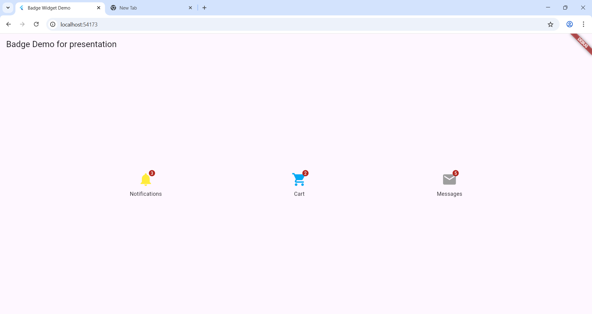

***Badge-App***

A simple Flutter app designing to demonstrate Badge widgets, specifically for notifications, shopping cart, and messages 
__________________________________________________________________________

**How to Run**

    Make sure you have Flutter installed: Flutter setup guide

    Clone this repo:

        "git clone https://github.com/Effiong06/Badge-App.git"
        "cd Badge-App"

    Get dependencies:

        "flutter pub get"

    Run the app:

        "flutter run"

____________________________________________________________________

 **Features**

    Badge indicators for icons

    Custom colors for each badge

    Simple layout for presentation purposes

____________________________________________________________________

 **Screenshot**

